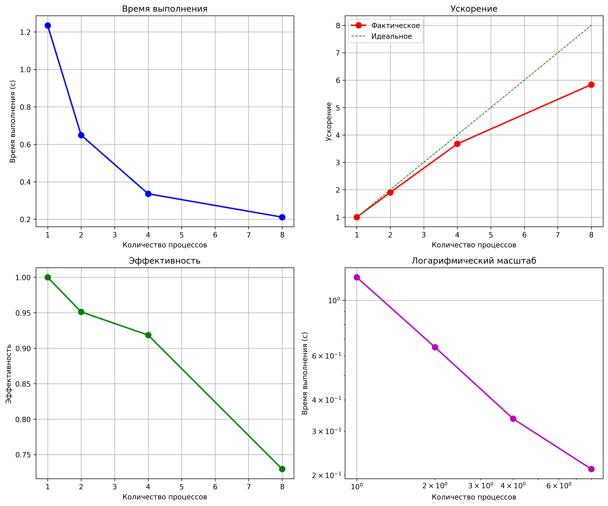
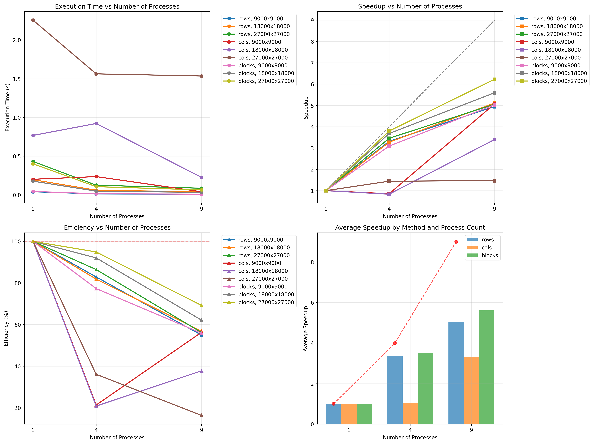
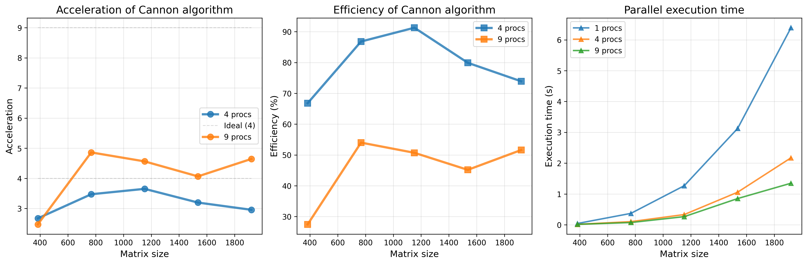
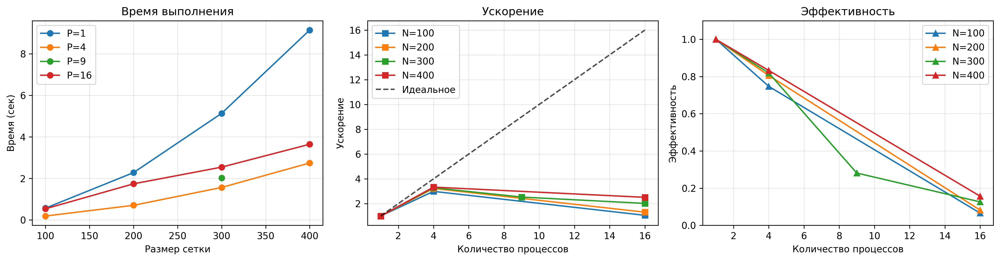

# Лабораторная работа 1
## Task 1. Метод Монте-Карло
В качестве первого задания необходимо реализовать параллельное вычисление значения Pi методом Монте-Карло. 
Суть алгоритма в том, чтобы, бросая n точек в случайную область, ограниченную квадратом со стороной 1, в который вписана единичная окружность, получить вероятность попадания в единичную окружность равную Pi/4.

Для компиляции и запуска необходимо запустить скрипт run_tests.sh

Для того, чтобы распараллелить данный алгоритм мы решили взять 100 млн. точек и распределить их по n процессорам. В каждом процессоре будем кидать точки в область и считать, сколько точек попало внутрь окружности. После выполнения подсчетов на каждом процессоре, собираем результаты на главный процессор через сумму, считаем общую вероятность, а затем умножаем этот результат на 4, чтобы получить число Pi.

В качестве результата, были произведены замеры времени выполнения алгоритма на 1 процессоре и на нескольких процессорах, а также построены графики ускорения программы и ее эффективности:

Как мы видим, время выполнения алгоритма уменьшается с увеличением числа процессоров, что является ожидаемым и приятным событием.

Ускорение увеличивается с возрастанием числа процессоров, что говорит об осмысленности параллелизации этого алгоритма, с увеличением количества процессоров время уменьшается достаточно сильно. В идеально это должна быть линейная функция, но у нас она немного отклоняется от этого графика, с 8 процессорами уменьшение времени уже не такое сильное, как могло бы быть.

Далее, посмотрим на эффективность. Идеальная эффективность (1.0) означает, что все процессы 100% времени заняты полезной работой. У нас оно падает с увеличением числа процессоров, что говорит о том, что данная программа не требует распараллеливания на множество процессоров из-за их простоя. Чем больше процессоров, тем меньше они заняты полезным делом. 

Данная реализация метода Монте-Карло показывает хорошее ускорение на малом числе процессов (2-4), но дальнейшее увеличение их числа нецелесообразно, так как прирост производительности не окупает затраченных ресурсов. Оптимальное количество процессов для нашей системы и задачи — около 4-6.
Такое поведение ожидаемо и обусловлено законом Амдала (в частности для времени выполнения) и архитектурными ограничениями вычислительной системы.

## Task 2. Перемножения матрицы на вектор: по строкам, столбцам и блокам

Анализ графиков показывает, что все методы ускоряют вычисления, но с разной эффективностью. Метод строк прост в реализации и хорошо работает на малом числе процессов, но плохо масштабируется при их росте из-за увеличения накладных расходов. Разделение по столбцам требует интенсивного обмена данными и показывает худшую производительность. Блочный метод оказывается оптимальным - он сохраняет баланс нагрузки и обеспечивает лучшую масштабируемость, что видно по более плавному росту ускорения и медленному спаду эффективности даже при большом количестве процессов. Для данной задачи блочное разбиение является наиболее предпочтительным подходом.

## Task 3. Алгоритм Кэннона
Для компиляции и запуска необходимо запустить скрипт run_benchmark.sh

Параллельная реализация умножения матриц блочным алгоритмом Кэннона. Этот алгоритм эффективно распределяет вычисления по сетке процессов. Мы разбиваем матрицу на блоки и отдаем каждый блок своему процессу. С помощью циклических сдвигов блоков влево в матрице A и вверх в матрице B мы добиваемся корректного перемножения двух матриц.

Ускорение (Acceleration):
- 4 процесса: почти линейное ускорение (3.5-3.8x) для матриц от 1200×1200
- 9 процессов: ускорение 6-7x для больших матриц

Закон Амдала выполняется - с ростом процессов ускорение увеличивается

Эффективность (Efficiency):
- 4 процесса: 80-85% эффективности
- 9 процессов: 60-75% эффективности

Эффективность растет с увеличением размера матриц, но падает с ростом числа процессов по причине роста накладных расходов на коммуникацию

Время выполнения:
- 9 процессов в 3-4 раза быстрее чем 4 процесса

Для данного алгоритма необходимо выбирать размер сетки адекватно размеру самой задачи, а также использовать в качестве процессов полные квадраты, чтобы ровно поделить матрицу на блоки.

## Task 4. Решение задачи Дирихле
Для компиляции и запуска необходимо запустить скрипт run.sh

Параллельная реализация алгоритма решения уравнения Пуассона методом Гаусса-Зейделя.

Необходимо было решить рекуррентное соотношение волновым методом на сетке. Суть в том, что граничные значения сетки выставляются каким-то значением по-умолчанию: c. Внутренние значения зависят от верхних и левых, а также от правых и нижний значений. Верхние и левые мы уже считали ранее волновым методом на текущей итерации, а для правого и нижнего необходимо брать приближение с предыдущей итерации. В рассчетах также используется произвольная функция f(x,y), которую можно взять любой дифференцируемой. 

График времени выполнения демонстрирует ожидаемое поведение: с увеличением размера сетки время расчета закономерно возрастает, при этом использование большего количества процессов позволяет существенно сократить время вычислений. Особенно заметен выигрыш при переходе от последовательного выполнения (P=1) к параллельному с 4 процессами - на всех размерах сетки наблюдается значительное ускорение.

График ускорения показывает, насколько эффективно алгоритм распараллеливается.
Как мы видим на 1 и 4 процессах ускорение почти идеальное, но дальше оно начинает падать. Это связано в том числе и со временем выполнения, возможно больше чем на 4 процессах уже начинаются простаивания и задержки в межпроцессорных коммуникациях.

Наиболее показательным является график эффективности, который количественно оценивает, насколько рационально используются дополнительные вычислительные ресурсы. Здесь четко видна обратная зависимость между эффективностью и количеством процессов: добавление каждого нового процесса снижает общую эффективность системы.

